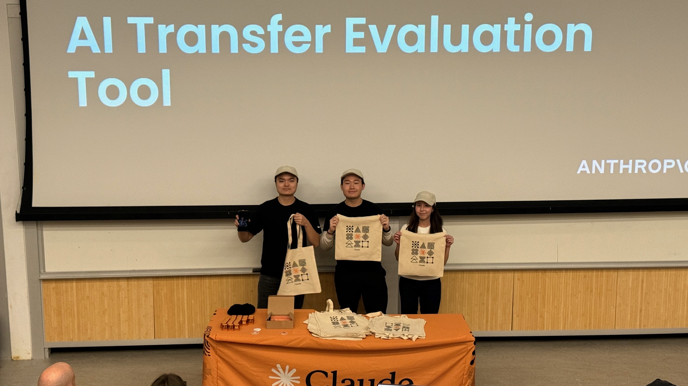

# 🎓 AI Transfer Evaluation Tool

<div align="center">
  

  ### **Winner - Anthropic Claude Hackathon**

  

  *First place winners at the Anthropic Claude Hackathon*

  An intelligent web application that helps Washington community college students instantly understand how their credits transfer to the University of Washington.

  [](https://transfer.joechamdani.cloud/)
  [](https://www.youtube.com/watch?v=F8It4V7N1hg)
  [](https://devpost.com/software/ai-transfer-evaluation-tool)
  [](https://nextjs.org/)
  [](https://www.typescriptlang.org/)
  [](https://anthropic.com)
</div>

---

## Overview

Transfer students often spend hours manually comparing course catalogs, navigating multiple websites, and waiting for advisor responses to understand which of their credits will transfer. The **AI Transfer Evaluation Tool** solves this problem by providing instant, accurate transfer credit predictions in seconds.

Built by transfer students, for transfer students.

### Key Features

- **AI-Powered Transcript Parsing** - Upload PDFs, images, or paste text. Claude Vision extracts course data automatically
- **Real Equivalency Data** - 157+ verified Bellevue College → UW course mappings from official equivalency guides
- **Smart Matching** - Direct matches, semantic analysis, and clear flagging for courses needing advisor review
- **Professional Reports** - Download clean, formatted PDF reports for advising appointments
- **Advisor Email Generator** - AI-crafted emails for courses requiring manual review
- **Instant Results** - Get comprehensive evaluations in seconds, not days

---

## Live Demo

<div align="center">

### **Try it now at [transfer.joechamdani.cloud](https://transfer.joechamdani.cloud/)**

<table>
<tr>
<td align="center" width="50%">

**Live Application**

[](https://transfer.joechamdani.cloud/)

Experience the tool in action 

</td>
<td align="center" width="50%">

**Video Demo**

[](https://www.youtube.com/watch?v=F8It4V7N1hg)

See a walkthrough of all features

</td>
</tr>
</table>

<a href="https://www.youtube.com/watch?v=F8It4V7N1hg">
  
</a>

</div>

Or follow the [Quick Start](#quick-start) guide to run it locally

---

## Team

- **Joseph Davis Chamdani** - [@JosephDavisC](https://github.com/JosephDavisC)
- **Juwita Jessica Pangestu** - [@JuwitaJessicaP](https://github.com/JuwitaJessicaP)
- **Winson Teh** - [@win719](https://github.com/win719)
- **Kenneth Wu** - [@kennethwu30](https://github.com/kennethwu30)

**Project Links:**
- [Devpost](https://devpost.com/software/ai-transfer-evaluation-tool)
- [Demo Video](https://www.youtube.com/watch?v=F8It4V7N1hg)

---

## Quick Start

### Prerequisites

- Node.js 18+ installed
- Anthropic API key ([Get one here](https://console.anthropic.com/))

### Installation

1. **Clone the repository**
   ```bash
   git clone https://github.com/JosephDavisC/AI-Transfer-Evaluation-Tool
   cd claude_hackathon
   ```

2. **Install dependencies**
   ```bash
   npm install
   ```

3. **Configure environment variables**

   Create a `.env.local` file in the root directory:
   ```env
   ANTHROPIC_API_KEY=your_actual_api_key_here
   ANTHROPIC_MODEL_ID=claude-sonnet-4-5-20250929
   ```

4. **Run the development server**
   ```bash
   npm run dev
   ```

5. **Open your browser**

   Navigate to [http://localhost:3000](http://localhost:3000)

---

## How to Use

1. **Enter your information** - Name and intended major at UW
2. **Upload your transcript** - Drag & drop a PDF/image, or paste plain text
3. **Click "Evaluate Transfer Credits"** - Watch the AI process your courses in real-time
4. **Review your results** - See detailed transfer report with color-coded matches:
   - **Green** - Direct equivalency match
   - **Blue** - Semantic match (similar course content)
   - **Yellow** - Elective credit (counts toward degree, no direct equivalent)
   - **Red** - Requires advisor review
5. **Download PDF report** - Get a professional document for advising appointments
6. **Generate advisor email** - AI-crafted email template for unmatched courses

### Sample Transcript Format

```
MATH& 151 - Calculus I - 5 credits - Grade: A
ENGL& 101 - English Composition - 5 credits - Grade: B+
CS& 141 - Computer Science I - 4 credits - Grade: A
CHEM& 161 - General Chemistry I - 5 credits - Grade: A-
HIST& 146 - United States History I - 5 credits - Grade: B
```

---

## Technical Architecture

### Tech Stack

- **Frontend:** Next.js 14, React 18, TypeScript, Tailwind CSS
- **AI/ML:** Anthropic Claude API (Sonnet 4.5 with Vision)
- **PDF Processing:** jsPDF, pdf-parse
- **Backend:** Next.js API Routes, Node.js

### Project Structure

```
transfer-eval-tool/
├── app/
│   ├── api/
│   │   ├── parse-transcript/          # Text-based transcript parser
│   │   ├── parse-transcript-file/     # PDF/Image parser (Claude Vision)
│   │   ├── match-courses/             # Course matching engine
│   │   ├── generate-advisor-request/  # AI email generator
│   │   └── utils/
│   │       └── courseParser.ts        # Shared parsing utilities
│   ├── page.tsx                       # Main UI component
│   └── layout.tsx                     # App layout & metadata
├── data/
│   └── bellevue-uw-equivalencies.json # 157 verified BC→UW mappings
├── public/                            # Static assets
└── .env.local                         # API keys (not committed)
```

### How It Works

1. **Transcript Processing**
   - User uploads PDF/image or pastes text
   - Claude Vision API extracts course information
   - Structured output ensures consistent parsing

2. **Course Matching**
   - Exact matches checked against 157+ verified equivalencies
   - Semantic matching uses Claude to compare course descriptions
   - Applies UW's 90-credit transfer cap automatically

3. **Report Generation**
   - AI summarizes findings in student-friendly language
   - jsPDF creates downloadable professional reports
   - Claude generates personalized advisor request emails

---

## Problem & Solution

### The Problem

Transfer students from Washington community colleges face:
- Hours spent manually comparing course catalogs
- Jumping between multiple websites and documents
- Long wait times for advisor email responses
- Uncertainty about which credits will count
- Anxiety about losing credits or delaying graduation

### Our Solution

- **Instant predictions** in seconds instead of days
- **Accurate matching** using real UW equivalency data
- **Clear categorization** of all course types
- **Professional reports** ready for advising appointments
- **Reduced advisor workload** with pre-evaluated transcripts

### Impact

- **For Students:** Better academic planning, reduced stress, maximized transferred credits
- **For Advisors:** 60%+ reduction in routine equivalency questions
- **For Institutions:** Smoother transfer pipeline, higher student satisfaction

---

## Hackathon Journey

### Inspiration

As transfer students ourselves, we experienced firsthand the frustration of navigating UW's transfer equivalency process. We built this tool to streamline that experience for future transfers.

### Key Challenges

- **Transcript Formatting Variations** - Different colleges format transcripts differently; required extensive prompt engineering
- **Accurate Matching** - Balancing prediction confidence with practical utility
- **Privacy & Security** - Implementing proper consent and secure handling of student documents
- **Time Constraints** - Building a production-ready app in a hackathon timeframe

### Accomplishments

- Created a functional tool that reduces research time from hours to seconds
- Implemented real equivalency data from official UW sources
- Built comprehensive features: parsing, matching, reports, and email generation
- Designed intuitive UX that requires no technical knowledge
- **Won the Anthropic Claude Hackathon!**

### What We Learned

- Advanced prompt engineering techniques for structured outputs
- Claude Vision API capabilities for document processing
- Importance of user consent and privacy in AI applications
- Practical challenges in building AI tools for education

---

## License

This project is licensed under the MIT License - see the [LICENSE](LICENSE) file for details.

---

**If this project helped you, please give it a star!**
